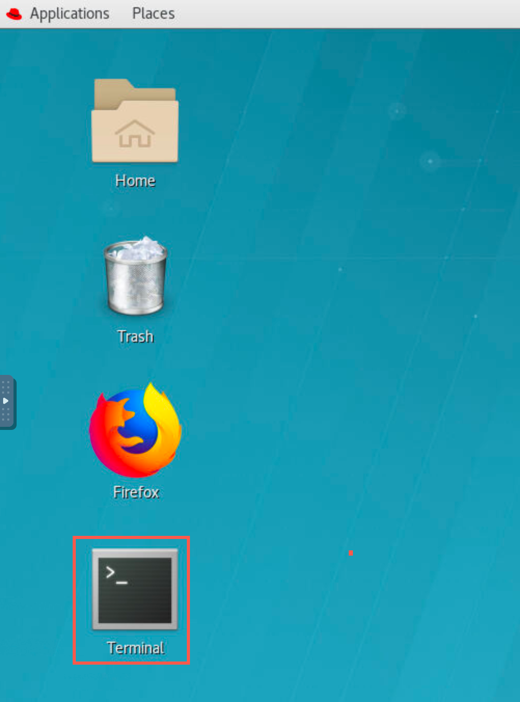
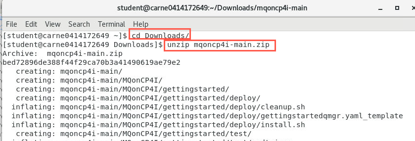
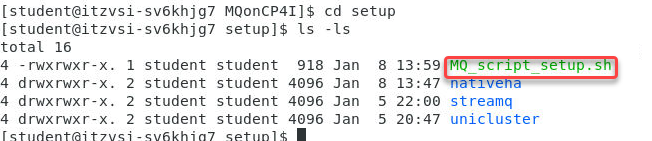
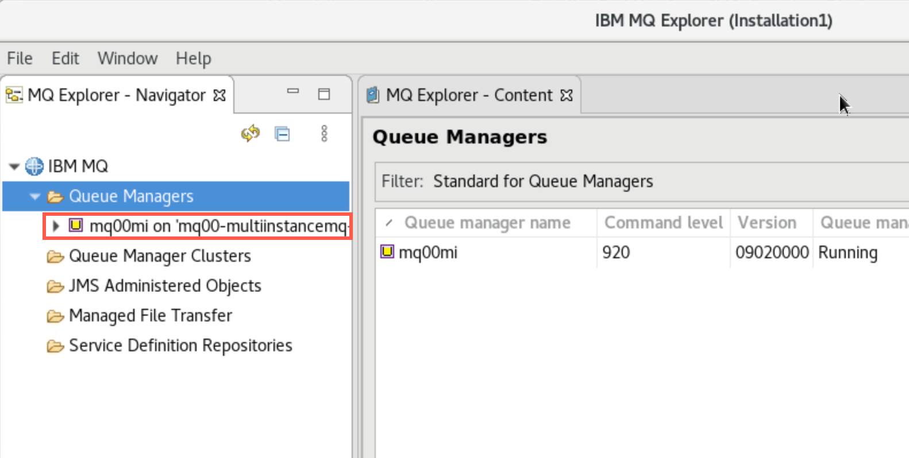
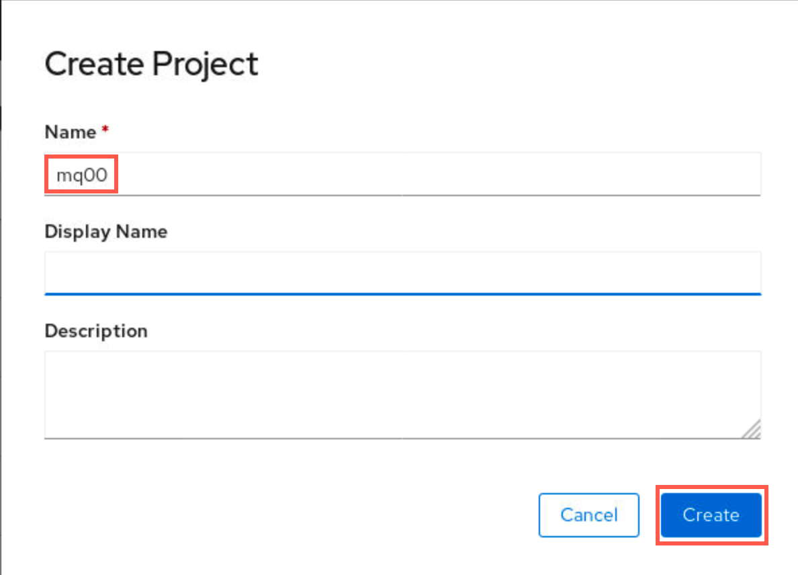
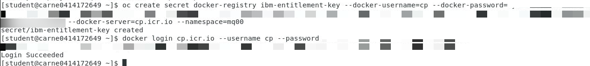

# Setup environment for MQ CP4I PoT
# Table of Contents 
- [1. Download artifacts for MQ on CP4I](#download-artifacts-for-mq-on-cp4i-pot)
- [2. Connecting MQ Explorer to a deployed Queue Manager in OpenShift](#connecting-mq-explorer-to-a-deployed-queue-manager-in-openshift)
- [3. IBM Only - Create Project (namespace) for your lab assets](#ibm-only---create-project-namespace-for-your-lab-assets)


<a name="download"></a>	
## Download artifacts for MQ on CP4I PoT

You should be logged on your VDI as *student*. 

1. Open a Firefox browser tab and navigate to [Github MQonCP4i](https://github.com/jjodl/mqoncp4i).

	
	
1. Click *Code* and select *Download zip*.

	

1. Click *Save file* radio button then click *OK*.

	
	
1. Open a terminal window by double-clicking the icon on the desktop.

	
	
1. Enter the following command to see the zip file you just downloaded.

	```
	cd Downloads
	```
	
1. Enter the following command to unzip the downloaded file:

	```
	unzip mqoncp4i-main.zip
	```
	
	
	
1. Move the unzipped directory to your home directory with the following command:
	
	```
	cd mqoncp4i-main
	```
	
	```
	mv MQonCP4I/ ~/
	```
	
	 
	
	This will create the directory **/home/student/MQonCP4I**.  Change to your home directory and list the contents of the directory to verify that it contains *MQonCP4I*. 
	
	```sh
	cd ~/MQonCP4I
	ls -l 
	```
1. Now first we will need to change the mode to executable for all the scripts.   From the MQonCP4I directory run the following command.

	```
	find . -type f -iname "*.sh" -exec chmod +x {} \;
	```
	


9. Now we will change to the **setup** directory to run the script that will create all the install scripts for your userid.  
	
	```sh
	cd setup
	ls -l 
	```
	
	

1. 	Now run the MQ_script_setup.sh You will use your student id that was given to you from the instructor.

**Note:** In this example we are user palpatine5 so would use that as the namespace and 05 as the student id.


	
Great! You are now ready to start working with MQ in the labs. If running a PoT, attendees are now ready to start Lab 1 where they will create queue managers using their assigned IDs.

[Continue to Lab 1](../Lab_3/mq_cp4i_pot_lab3.md#introduction)

[Return MQ CP4I Menu](../index.md#introduction)

## Connecting MQ Explorer to a deployed Queue Manager in OpenShift
<a name="mqexplorer"></a>	
These steps document how you can connect MQ Explorer to a Queue Manager running in OpenShift.

1. Open a new terminal window.
	
1. Enter the following command to start MQ Explorer making sure to use the correct case:

	```
	MQExplorer
	```
	
		
1. When the utility is ready, right-click *Queue Managers* and select *Add Remote Queue Manager*.

	

1. Enter your queue manager name using your student ID. Click *Next*.

	

1. We will now need to get the hostname for this Qmgr to connect to it outside the OCP cluster to MQExplorer.   
Run the following command 

```
oc get route -n melch1 | grep mq01a
```
	Enter the value from the *host:* field in the *Host name of IP address*. This was the URL of the *Router Canonical Host* from the route. 
	Enter **443** for the *Port number*.
	Enter your SVRCONN channel name in the *Server-connection channel* field.
	
	**Note** for the uniform cluster lab do not click the checkbox for Multi-instance queue manager.
	
	Click *Next* three times.
	
	
	
	[For more information refer to KnowledgeCenter](https://www.ibm.com/support/knowledgecenter/SSFKSJ_9.1.0/com.ibm.mq.ctr.doc/cc_conn_qm_openshift.htm)
		
1. Click the checkbox for *Enable SSL key repositories*. Click *Browse* and navigate to */home/ibmuser/MQonCP4I/tls* and select **MQExplorer.jks**. Then click *Open*.

	
	
1. Click the *Enter password* button and enter the jks password **'password'**. Click *OK* then *Next*.

	
	
1. On the next screen click the checkbox for *Enable SSL options*. Click the drop-down next to *SSL CipherSpec* and select **ANY_TLS12_OR_HIGHER**.

	
	
1. Click *Finish*. You will get a pop-up saying "Trying to connect to the queue manager".

	
	
1. After a few seconds you see that MQ Explorer has connected. The Queue Manager will be added and shown in the navigator.

	
	
1. Operate MQ Explorer as you normally would. Expand the queue manager and "explore" MQ looking at queues, channels, etc.

	

[Return MQ CP4I Menu](../index.md#introduction)


<a name="namespace"></a>
## IBM Only - Create Project (namespace) for your lab assets

1. Click *Projects* then click *Create project*.

	
	
1. Select a student number between 01 - 99. Append this number to "mq" to create your unique project name within the cluster (**mq00** is reserved for the instructor and has been used to document the lab). Project is the term for namespace in OpenShift. This is used to keep your assets separate from the other students.

	Enter the name of your project **mqxx** in the name field and click *Create*. 
	
	
	
### Create entitlement secret for your namespace

1. In OCP console, click the drop-down next to your username and select "Copy Login Command".

	

1. A new browser tab opens. Click the *Display Token* hyperlink.

	
	
1. Copy the command under "Log in with this token".

	
	
1. Open a terminal window and paste the command into the terminal and hit enter which logs you into the cluster. Enter the following command to change to your namespace. Make sure to substitute 00 with your student number.

	```
	oc project mq00
	```

	
	
	Note - "An entitlement key will be provided to you as part of the PoT. If you already have an entitlement key you may use it."
		
1. Enter the following command to create the secret replacing "**your-entitlement-key-goes-here**" with your real entitlement key:
	
	```
	oc create secret docker-registry ibm-entitlement-key --docker-username=cp --docker-password=**your-entitlement-key-goes-here** --docker-server=cp.icr.io --namespace=mq00
	```
	
1. You can now login to Docker with the following command replacing "**your-entitlement-key-goes-here**" with your entitlement key.

	```
	docker login cp.icr.io --username cp --password **your-entitlement-key-goes-here**
	```
	
	
